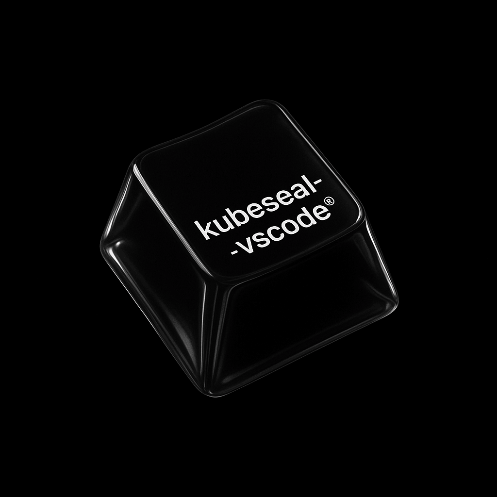

# Kubeseal VSCode Extension

<p align="center">
  
</p>

<p align="center">
  <a href="https://marketplace.visualstudio.com/items?itemName=ops4life.kubeseal-vscode">
    
  </a>
  <a href="https://marketplace.visualstudio.com/items?itemName=ops4life.kubeseal-vscode">
    
  </a>
  <a href="https://marketplace.visualstudio.com/items?itemName=ops4life.kubeseal-vscode">
    
  </a>
  <a href="https://github.com/ops4life/kubeseal-vscode/actions/workflows/ci.yaml">
    
  </a>
  <a href="LICENSE">
    
  </a>
  <a href="https://ops4life.github.io/kubeseal-vscode">
    
  </a>
  <a href="https://github.com/ops4life/kubeseal-vscode/issues">
    
  </a>
  <a href="https://github.com/ops4life/kubeseal-vscode/commits/main">
    
  </a>
</p>

## 📚 Table of Contents

- [Kubeseal VSCode Extension](#kubeseal-vscode-extension)
  - [📚 Table of Contents](#-table-of-contents)
  - [🚀 Installation](#-installation)
  - [✨ Features](#-features)
  - [🔄 How It Works](#-how-it-works)
  - [🎥 Video Demonstration](#-video-demonstration)
  - [📋 Requirements](#-requirements)
  - [🛠️ Setup](#️-setup)
  - [📖 Usage](#-usage)
    - [Typical Workflow](#typical-workflow)
    - [🖥️ Sidebar Panel](#️-sidebar-panel)
    - [🔐 Encrypting Secrets](#-encrypting-secrets)
    - [🔓 Decrypting Secrets](#-decrypting-secrets)
    - [🔧 Managing Certificates](#-managing-certificates)
      - [Setting Certificate Folder](#setting-certificate-folder)
      - [Selecting Active Certificate](#selecting-active-certificate)
    - [📝 Base64 Encoding/Decoding](#-base64-encodingdecoding)
      - [Encode Base64 Values](#encode-base64-values)
      - [Decode Base64 Values](#decode-base64-values)
  - [⚙️ Configuration](#️-configuration)
  - [🎮 Commands](#-commands)
  - [🛠️ Getting Help](#️-getting-help)
  - [⚠️ Known Issues](#️-known-issues)
  - [🤝 Contributing](#-contributing)
  - [📄 License](#-license)
  - [🔗 Links](#-links)

## 🚀 Installation

**Install from VS Code Marketplace:**

1. Open VS Code
2. Go to Extensions (Ctrl+Shift+X)
3. Search for "Kubeseal VSCode"
4. Click Install

**Or install directly:**

- [Download from Releases page](https://github.com/ops4life/kubeseal-vscode/releases)

**Recommended Extensions:**

For the best Kubernetes development experience, we recommend installing:

- [Kubernetes](https://marketplace.visualstudio.com/items?itemName=ms-kubernetes-tools.vscode-kubernetes-tools) - Provides Kubernetes cluster management, syntax highlighting, and IntelliSense for Kubernetes YAML files.

## ✨ Features

- **🔐 Encrypt Secrets**: Right-click on YAML files containing Kubernetes secrets to encrypt them using kubeseal
- **🔓 Decrypt Secrets**: Retrieve the original content of sealed secrets from your Kubernetes cluster
- **📝 Base64 Encoding/Decoding**: Encode and decode base64 values using the system `base64` binary — handles Unicode, emoji, special characters, multiline values, TLS certs, and `stringData` promotion
- **🖥️ Sidebar Panel**: A modern, interactive sidebar containing all utilities in one place. Quick-encode/decode text, check certificate status, run encryption/decryption on the active editor, and manage certificates directly.
- **📂 Certificate Folder Management**: Configure a folder containing multiple kubeseal certificates and easily switch between them
- **🔄 Active Certificate Selection**: Click on the status bar to select which certificate to use for encryption
- **🎯 Context Menu Integration**: Access kubeseal operations directly from the file explorer and editor context menus

## 🔄 How It Works

This extension integrates with the [Bitnami Sealed Secrets](https://github.com/bitnami-labs/sealed-secrets) workflow for securing Kubernetes secrets:

### Encryption Workflow

```
┌─────────────────────┐
│  Plain Secret YAML  │  (your-secret.yaml)
│  kind: Secret       │
└──────────┬──────────┘
           │
           │ Right-click → "Encrypt with Kubeseal"
           │
           ▼
┌─────────────────────┐
│   kubeseal CLI      │  Uses selected certificate
│   Encryption        │  from configured folder
└──────────┬──────────┘
           │
           ▼
┌─────────────────────┐
│ SealedSecret YAML   │  (your-secret-sealed.yaml)
│ kind: SealedSecret  │  ✓ Safe to commit to Git
└─────────────────────┘
```

**Key Points:**
- Requires `kubeseal` binary in PATH
- Uses certificate from your configured folder
- Original secret remains unchanged
- Creates new file with `-sealed` suffix
- Encrypted secrets are safe to store in version control

### Decryption Workflow

```
┌─────────────────────┐
│ SealedSecret YAML   │  (deployed to cluster)
│ kind: SealedSecret  │
└──────────┬──────────┘
           │
           │ Right-click → "Decrypt Secret"
           │
           ▼
┌─────────────────────┐
│   kubectl CLI       │  Fetches from cluster using
│   Get Secret        │  namespace and name from YAML
└──────────┬──────────┘
           │
           ▼
┌─────────────────────┐
│  Plain Secret YAML  │  (your-secret-unsealed.yaml)
│  kind: Secret       │  Retrieved from cluster
└─────────────────────┘
```

**Key Points:**
- Requires `kubectl` binary in PATH
- Requires cluster access with proper permissions
- SealedSecret must be deployed to the cluster first
- Extension extracts namespace/name from SealedSecret YAML
- Creates new file with `-unsealed` suffix

### Base64 Encoding/Decoding Workflow

```
Before Encoding:                After Encoding:
┌────────────────────────┐      ┌────────────────────────────────┐
│ kind: Secret           │      │ kind: Secret                   │
│ data:                  │Encode│ data:                          │
│   username: admin      │─────▶│   username: YWRtaW4=           │
│   password: P@ss!🔑    │      │   password: UEBzcyHwn5KR       │
│   token: YWJj... (b64) │      │   token: YWJj... (skipped ✓)  │
└────────────────────────┘      └────────────────────────────────┘

stringData is also promoted to data during encoding.
Decoding reverses the process ◀──────────────────────────────────
```

**Key Points:**
- Works on local YAML files (no cluster needed)
- Uses the system `base64` binary — same tool as `kubectl` and `openssl`
- Handles all Unicode: emoji 🌍, CJK, Arabic, special symbols, newlines, tabs
- Reliably detects already-encoded values via roundtrip check — no double-encoding
- Encodes `stringData` values and promotes them to `data` automatically
- Preserves binary values (TLS certs, SSH keys, images) as base64 when decoding
- Useful for preparing secrets before encryption

## 🎥 Video Demonstration

Watch how to use the Kubeseal VS Code extension in action:

[](https://youtu.be/NAcHxSNFhyc)

## 📋 Requirements

> **Important:** You must have access to your Kubernetes cluster before using this extension, especially for decryption.

**Development Requirements:**

- Node.js 20+ (for development and building)

**Runtime Requirements:**

- `kubeseal` binary must be installed and accessible in your PATH
- `kubectl` binary must be installed and configured for cluster access
- For encryption: A kubeseal certificate folder containing certificate files (`.pem`, `.crt`, or `.cert`)
- For decryption: Access to the Kubernetes cluster where the secret is deployed

## 🛠️ Setup

1. Install the `kubeseal` binary from [sealed-secrets releases](https://github.com/bitnami-labs/sealed-secrets/releases)
2. Install this extension from the VS Code marketplace
3. Configure your certificate folder using the command palette: "Set Kubeseal Certificate Folder"
4. Select an active certificate by clicking on the status bar item

## 📖 Usage

> **Note:** You must have access to your Kubernetes cluster before using the extension. Decryption will not work unless your `kubectl` is configured and you have the necessary permissions.

### Typical Workflow

Here's a typical workflow for managing secrets with this extension:

1. **Prepare your secret** - Create a Kubernetes Secret YAML file with plain text values
2. **Encode values (optional)** - Use "Encode Base64 Values" if your values are in plain text
3. **Set up certificate** - Configure your certificate folder and select an active certificate
4. **Encrypt** - Use "Encrypt with Kubeseal" to create a SealedSecret
5. **Commit safely** - The encrypted SealedSecret can be safely committed to Git
6. **Deploy** - Apply the SealedSecret to your Kubernetes cluster
7. **Decrypt (if needed)** - Use "Decrypt Secret" to retrieve the original secret from the cluster

### 🖥️ Sidebar Panel

The extension features a modern, Material Design-inspired sidebar panel accessible via the Activity Bar (Kubeseal icon). It is divided into two tabs:

#### 1. Tools Tab
* **Base64 Converter**: Paste any text to quickly encode or decode without modifying your file, with a one-click copy button.
* **Actions**:
  * **Certificate Status**: Real-time status display of your active certificate with colour-coded expiry information:
    * 🟢 **Green** — certificate is valid, shows days remaining (e.g. `✓ Valid until Jun 30, 2027 (380d)`)
    * 🟡 **Amber** — certificate expires within 30 days (e.g. `⚠ Expires in 12 days (Jun 28, 2026)`)
    * 🔴 **Red** — no certificate selected, or certificate has expired (e.g. `⚠ Expired on Mar 15, 2026`)
  * **Active Editor Controls**: Quick **Encrypt** and **Decrypt** buttons that operate on the currently open YAML editor in VS Code.

#### 2. Settings Tab
* **Certs Folder**: Click the browse button to set your certificate store directory.
* **Active Certificate**: A dropdown list to easily switch between your certificates (`.pem`, `.crt`, or `.cert` files) in the configured folder.

### 🔐 Encrypting Secrets

1. Create a Kubernetes secret YAML file
2. Right-click on the file in the explorer or editor
3. Select "Encrypt with Kubeseal"
4. The encrypted file will be saved with `-sealed` suffix

**Example:**
```yaml
# input: my-secret.yaml
apiVersion: v1
kind: Secret
metadata:
  name: my-secret
  namespace: default
data:
  username: YWRtaW4=
  password: cGFzc3dvcmQ=

# output: my-secret-sealed.yaml
apiVersion: bitnami.com/v1alpha1
kind: SealedSecret
metadata:
  name: my-secret
  namespace: default
spec:
  encryptedData:
    username: AgBy3i4OJSWK+PiTySYZ...
    password: AgAKqjbxK9...
```

### 🔓 Decrypting Secrets

1. Right-click on a sealed secret YAML file
2. Select "Decrypt Secret"
3. The extension will retrieve the actual secret from your Kubernetes cluster using `kubectl`
4. The decrypted secret will be saved with `-unsealed` suffix

**Example:**
```yaml
# input: my-secret-sealed.yaml (must be deployed to cluster)
apiVersion: bitnami.com/v1alpha1
kind: SealedSecret
metadata:
  name: my-secret
  namespace: default
spec:
  encryptedData:
    username: AgBy3i4OJSWK+PiTySYZ...
    password: AgAKqjbxK9...

# Extension extracts: namespace="default", name="my-secret"
# Runs: kubectl get secret my-secret -n default -o yaml

# output: my-secret-unsealed.yaml
apiVersion: v1
kind: Secret
metadata:
  name: my-secret
  namespace: default
data:
  username: YWRtaW4=
  password: cGFzc3dvcmQ=
```

**Requirements:**
- The sealed secret has been deployed to your cluster
- Your `kubectl` is configured to access the correct cluster
- You have permissions to read secrets in the target namespace

### 🔧 Managing Certificates

#### Setting Certificate Folder

- Use Command Palette: `Ctrl+Shift+P` → "Set Kubeseal Certificate Folder"
- Or configure in VS Code settings: `kubeseal.certsFolder`

#### Selecting Active Certificate

1. Look at the status bar at the bottom of VS Code
2. Click on the certificate name (or "(not selected)" if none is active)
3. Choose from the list of available certificates in your configured folder
4. The selected certificate will be used for all encryption operations

**Note**: If no certificate folder is configured, clicking the status bar will prompt you to set one up.

### 📝 Base64 Encoding/Decoding

The extension provides utilities for working with base64 encoded values in Kubernetes secrets:

#### Encode Base64 Values

1. Right-click on a Kubernetes secret YAML file
2. Select **"Encode Base64 Values"**
3. All plain text values in the `data` field will be encoded; already-encoded values are skipped automatically

**Also supports `stringData`:** values are encoded and promoted to the `data` field.

**Example:**
```yaml
# Before encoding:
apiVersion: v1
kind: Secret
metadata:
  name: my-secret
data:
  username: admin             # plain text → will be encoded
  password: P@ssw0rd!🔑      # unicode special chars → handled correctly
  token: YWJjZGVmZ2hpams=   # already base64 → skipped
stringData:
  config: "host=localhost"   # stringData → encoded and moved to data

# After encoding:
apiVersion: v1
kind: Secret
metadata:
  name: my-secret
data:
  username: YWRtaW4=
  password: UEBzc3cwcmQh8J+Skw==
  token: YWJjZGVmZ2hpams=        # unchanged
  config: aG9zdD1sb2NhbGhvc3Q=  # promoted from stringData
```

#### Decode Base64 Values

1. Right-click on a Kubernetes secret YAML file
2. Select **"Decode Base64 Values"**
3. All base64 encoded values in the `data` field are decoded to plain text

**Note:** Binary values (TLS certificates, SSH keys, images) are automatically detected and kept as base64 to avoid corruption.

## ⚙️ Configuration

The extension provides the following settings:

- `kubeseal.certsFolder`: Path to the folder containing kubeseal certificate files (\*.pem, \*.crt, \*.cert)
- `kubeseal.activeCertFile`: Filename of the currently active certificate in the certs folder

## 🎮 Commands

- `kubeseal.encrypt`: Encrypt with Kubeseal
- `kubeseal.decrypt`: Decrypt Secret
- `kubeseal.setCertFolder`: Set Kubeseal Certificate Folder
- `kubeseal.selectCertificate`: Select Certificate
- `kubeseal.encodeBase64`: Encode Base64 Values
- `kubeseal.decodeBase64`: Decode Base64 Values

## 🛠️ Getting Help

If you encounter any issues or have questions, feel free to:

- Open an issue on [GitHub](https://github.com/ops4life/kubeseal-vscode/issues)
- Start a discussion in the [Discussions tab](https://github.com/ops4life/kubeseal-vscode/discussions)
- Email us at <support@example.com>

## ⚠️ Known Issues

- Decryption may fail if the `kubectl` context is not properly configured.
- Ensure the `kubeseal` binary is compatible with your Kubernetes cluster version.

For a complete list of changes, see the [Changelog](CHANGELOG.md).

## 🤝 Contributing

Contributions are welcome! Please read the [Contributing Guide](docs/guides/contributing.md) before submitting a Pull Request.

**Quick start for contributors:**

```bash
git clone https://github.com/ops4life/kubeseal-vscode.git
cd kubeseal-vscode
npm install
pre-commit install        # install pre-commit hooks
npm run test:base64       # run the base64 test suite
```

Pre-commit hooks enforce TypeScript type checking and the base64 test suite on every commit.
See [Contributing Guide](docs/guides/contributing.md) for full details.

## 📄 License

This project is licensed under the MIT License - see the [LICENSE](LICENSE) file for details.

## 🔗 Links

- [VS Code Marketplace](https://marketplace.visualstudio.com/items?itemName=ops4life.kubeseal-vscode)
- [GitHub Repository](https://github.com/ops4life/kubeseal-vscode)
- [Sealed Secrets Documentation](https://github.com/bitnami-labs/sealed-secrets)
